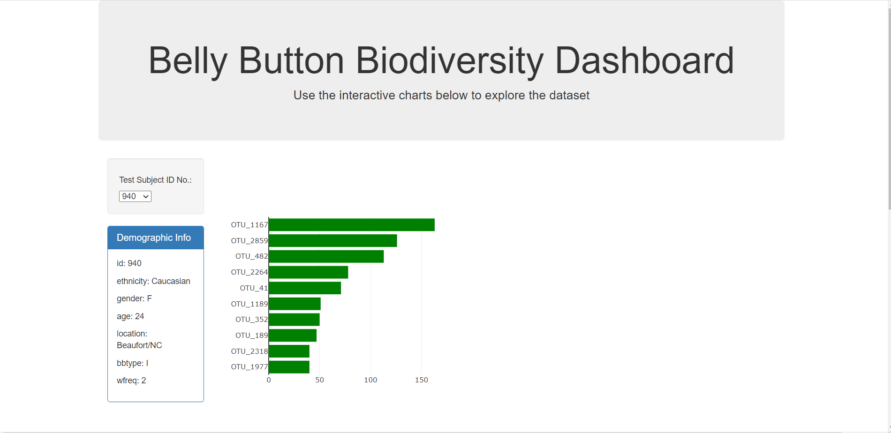
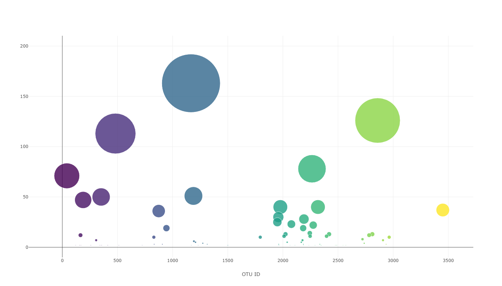
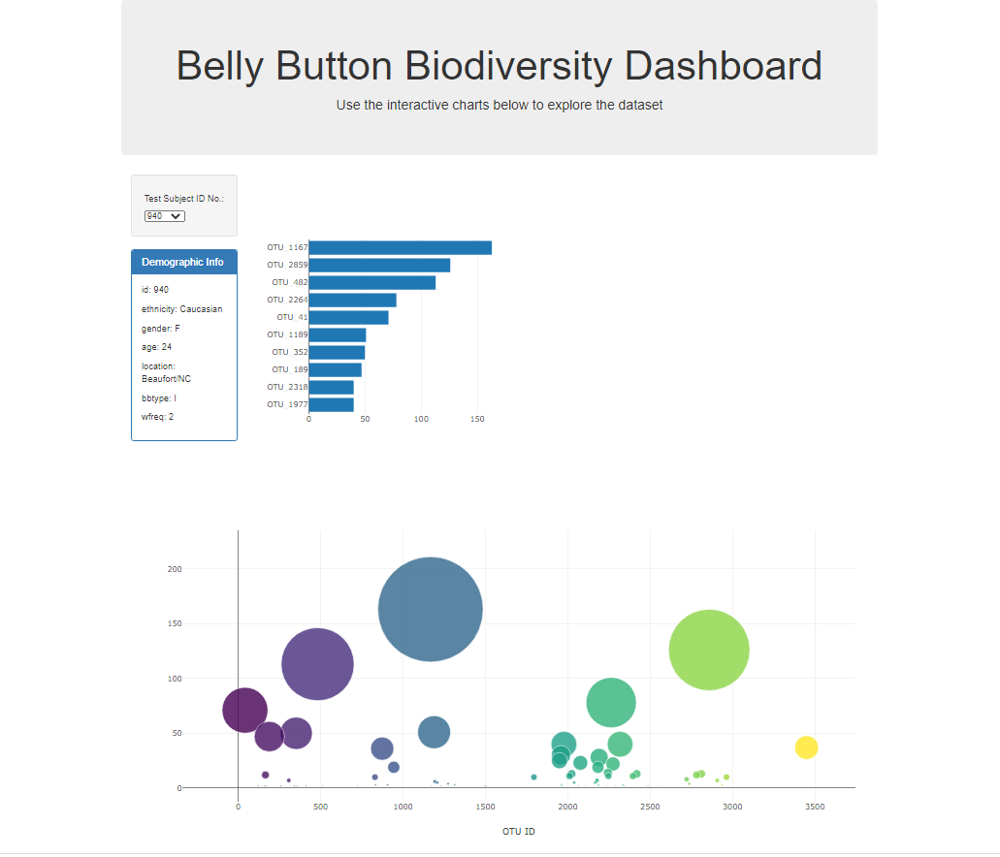

# belly-button-diversity

In this assignment, I built an interactive dashboard to explore the Belly Button Biodiversity dataset, which catalogs the microbes that colonize human navels.
This dataset reveals that a small handful of microbial species (also called operational taxonomic units, or OTUs, in the study) were present in more than 70% of people, while the rest were relatively rare.

First, I summarized the demographics information for each individual and created a dropdown to toggle between study participants. Then I created a horizontal bar chart to summarize top ten OTUs found in that participant's belly button. 

After creating the bar chart, I created an interactive bubble chart to represent the amount of the most common OTUs found in that individual's belly button.

The end result is an interactive dashboard that allows the user to toggle between subjects to compare belly button microbes and the quantity that is present in the subject's belly button.

Dashboard was lauched and can be found at: 
